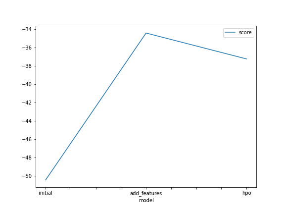
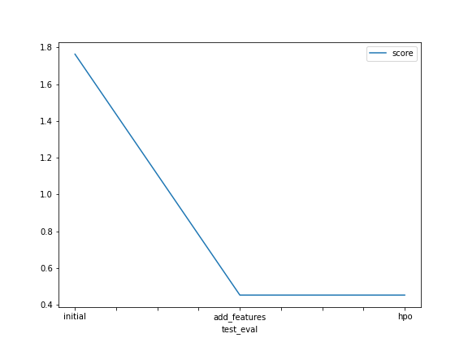

# Report: Predict Bike Sharing Demand with AutoGluon Solution
#### NAME HERE

## Initial Training
### What did you realize when you tried to submit your predictions? What changes were needed to the output of the predictor to submit your results?
First of all i hisitated to work the project in segmaker SageMaker studio
as i worried to messuse the budget specialy in the first begining so i prefered to start localy untill i get familiar with SageMaker studio. I had some troubles in the beginig setting up the libraries some had to apply them through my terminal but managed to get everything in the right manar. About the score i could improve the score from "1.76349" to "0.44707" and can work on improving more but i need sometime.
### What was the top ranked model that performed?
My third trial with adding some hyperparameters in learning rate, activation functions, and no. of epochs could get me to the score "0.44707" 

## Exploratory data analysis and feature creation
### What did the exploratory analysis find and how did you add additional features?
I found the most popular point in most of the datas i worked with, which is the datetime feature, and for sure i splitted it and added more features from "day,month,year and hour" which improved the model alittle bit. Also plotted a correlation matrix and a times series for the bike sharing features to check all of them and that helped a lot to understand the data I was working with.

### How much better did your model preform after adding additional features and why do you think that is?
It helped a lot to improve the score from "1.76349", to "0.45302".

## Hyper parameter tuning
### How much better did your model preform after trying different hyper parameters?
As i mentioned before, i tried the epochs no., and some activation functions also the learning rate and performed multiple rounds of the trials as it enhanced the score to best result i could get so far "0.44707" and actually i'm quiet bew to ML so I still need some extra informations to get to know these hyperparameters well.

### If you were given more time with this dataset, where do you think you would spend more time?
I would read some more documentations and papers in AutoGluon and hyperparameters to enhance my score with good knowledge.

### Create a table with the models you ran, the hyperparameters modified, and the kaggle score.
|model|hpo1|hpo2|hpo3|score|
|--|--|--|--|--|
|initial|"time_limit = 600"|"presets=best_quality"|"noun"|"1.76349"|
|add_features|"time_limit =600"|"presets=best_quality"|"new_features"|"0.45302"|
|hpo|"time_limit =600"|"presets=best_quality"|"AutoGluon_hyperparameter"|"0.44707"|

### Create a line plot showing the top model score for the three (or more) training runs during the project.

TODO: Replace the image below with your own.

### Create a line plot showing the top kaggle score for the three (or more) prediction submissions during the project.

TODO: Replace the image below with your own.

## Summary
I'm still new to that journey, tends to get aware with almost every single detail about it, very ambitious to learn more about ML and how to use it in my data science course, waiting to use SageMaker studio and AWS services with confidence and professionality, and going to read more about ML technologies and AWS services papers to enhance my knowlegde beside the nanodegree timeline I'm working on.
